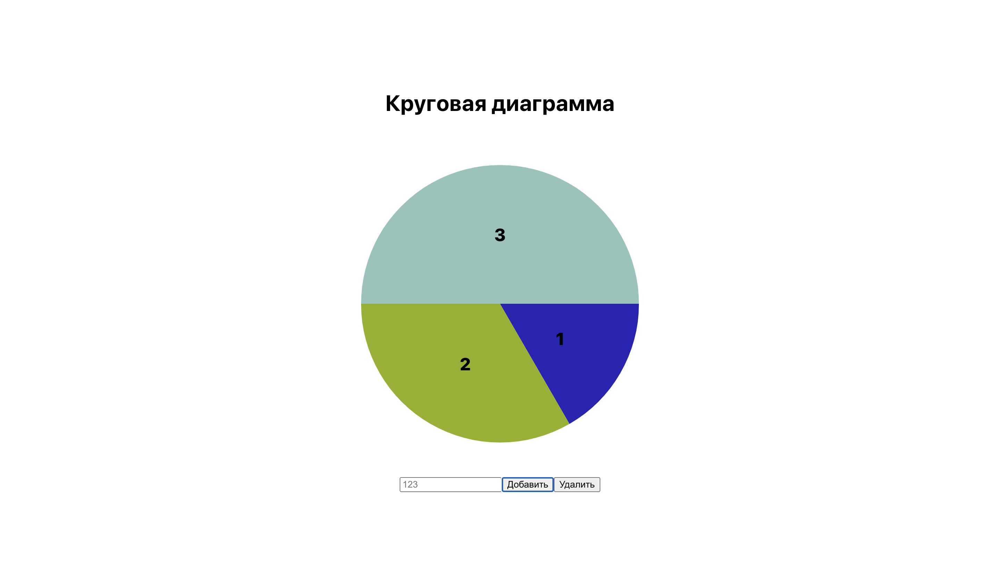

# Белов Вадим АП-926
## Разработка компонента для отображения круговых диаграмм

### Для запуска приложения нужно:
1) Склонировать проект `git clone`
2) Зайти в папку склонированного репозитория через терминал и `npm start`

